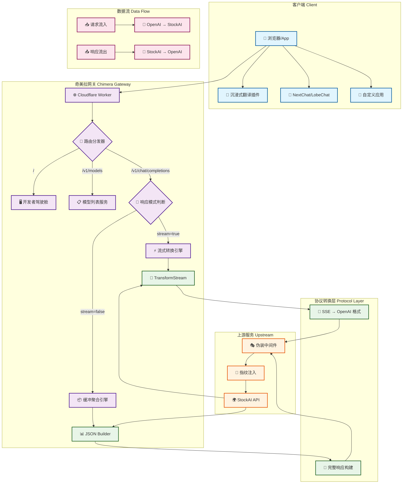
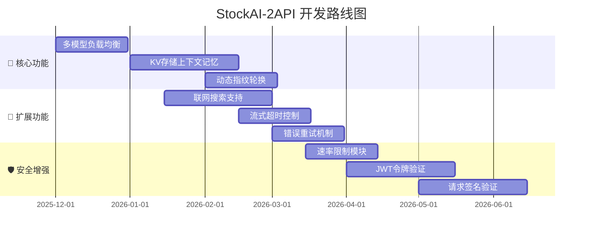
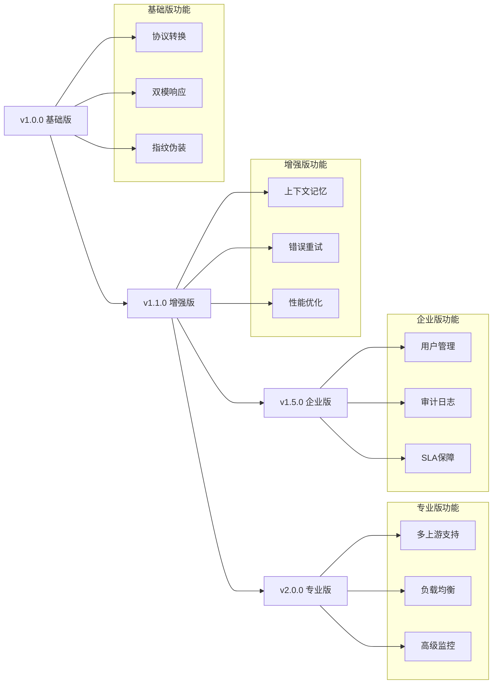

# 🌌 StockAI-2API: Chimera Synthesis Edition
### (Cloudflare Worker 单文件版 · 代号：奇美拉)

[](https://opensource.org/licenses/Apache-2.0)
[](https://deploy.workers.cloudflare.com/?url=https://github.com/lza6/stockai-2api-cfwork)
[](https://github.com/lza6/stockai-2api-cfwork)
[](https://platform.openai.com/docs/api-reference)
[]()

> **"代码是现实的桥梁，而我们是这桥梁的建设者。"**  
> **—— 《奇美拉协议 · 综合版》**

本项目旨在打破封闭生态的壁垒，通过 **奇美拉协议 (Chimera Protocol)**，将 StockAI 的私有接口无缝转换为通用的 OpenAI 标准接口。无论你是编程小白还是全栈大牛，都能通过本项目感受到"万物互联"的乐趣。

---

## 📖 目录导航

1. [✨ 项目简介与哲学](#-项目简介与哲学)
2. [⚡ 一键部署 (懒人模式)](#-一键部署-懒人模式)
3. [🎯 核心特性](#-核心特性)
4. [🔧 架构全景图](#-架构全景图)
5. [🧠 技术原理大揭秘](#-技术原理大揭秘)
6. [📚 详细使用教程](#-详细使用教程)
7. [⚖️ 优缺点分析](#⚖️-优缺点分析)
8. [🏗️ 项目结构与技术栈](#🏗️-项目结构与技术栈)
9. [🗺️ 开发者扩展指南](#🗺️-开发者扩展指南)
10. [🤖 致开发者与AI爬虫](#🤖-致开发者与ai爬虫)
11. [📜 开源协议](#📜-开源协议)

---

## ✨ 项目简介与哲学

**StockAI-2API** 是一个部署在 Cloudflare Workers 上的轻量级智能网关。它的核心使命是"协议翻译"——将标准 OpenAI API 请求实时转换为 StockAI 私有协议，同时保持高性能、高兼容性和隐私保护。

### 🌟 设计哲学
| 原则 | 说明 |
|------|------|
| **最小化原则** | 单文件实现完整功能，拒绝不必要的依赖 |
| **兼容性原则** | 同时支持流式与非流式响应，最大化工具兼容性 |
| **隐私性原则** | 无需登录，内置浏览器指纹，保护用户隐私 |
| **透明性原则** | 内置开发者驾驶舱，实时监控请求与响应 |

### 🎖️ 应用场景
- **沉浸式翻译插件** - 非流式 JSON 响应完美适配
- **NextChat / LobeChat** - 完整支持 OpenAI 格式
- **自定义 AI 应用** - 快速集成多模型支持
- **开发测试** - 内置 Web UI 调试界面

---

## ⚡ 一键部署 (懒人模式)

[](https://deploy.workers.cloudflare.com/?url=https://github.com/lza6/stockai-2api-cfwork)

### 🔧 手动部署教程

仓库已内置 `wrangler.toml`（入口 `worker.js`，兼容日期 `2024-12-11`），在本地或 CI 环境下可直接执行 `npx wrangler deploy` 完成发布，无需额外参数。

<details>
<summary><strong>📋 点击展开详细步骤</strong></summary>

1. **注册/登录 Cloudflare**
   - 访问 [Cloudflare Dashboard](https://dash.cloudflare.com)
   - 进入 `Workers & Pages` 页面

2. **创建 Worker**
   ```bash
   # 方法一：控制台创建
   1. 点击 "Create Application"
   2. 选择 "Create Worker"
   3. 输入名称：my-ai-gateway
   4. 点击 "Deploy"
   ```

3. **配置代码**
   ```javascript
   // 在 Worker 编辑器中：
   1. 点击 "Edit code"
   2. 清空默认代码
   3. 粘贴本项目的完整代码
   4. 点击 "Save and deploy"
   ```

4. **设置环境变量（可选）**
   ```yaml
   # 在 Worker Settings → Variables：
   - Name: API_MASTER_KEY
   - Value: your-secret-key-here
   - Type: Plain Text
   ```

5. **测试部署**
   - 访问你的 Worker URL：`https://my-ai-gateway.you.workers.dev`
   - 应该能看到开发者驾驶舱界面

</details>

### 🎮 快速验证
```bash
# 测试 API 端点
curl -X GET https://your-worker.workers.dev/v1/models

# 测试聊天接口
curl -X POST https://your-worker.workers.dev/v1/chat/completions \
  -H "Authorization: Bearer 1" \
  -H "Content-Type: application/json" \
  -d '{
    "model": "openai/gpt-4o-mini",
    "messages": [{"role": "user", "content": "Hello"}]
  }'
```

---

## 🎯 核心特性

### 🛡️ 双模适配引擎
| 模式 | 协议 | 适用场景 | 状态 |
|------|------|----------|------|
| **流式模式** | Server-Sent Events (SSE) | NextChat, LobeChat, Web UI | ✅ 完美支持 |
| **非流式模式** | JSON Response | 沉浸式翻译，部分插件 | ✅ 完美支持 |

### 🎭 智能伪装系统
```javascript
// 内置 Chrome 142 未来指纹
{
  "user-agent": "Mozilla/5.0 (Windows NT 10.0; Win64; x64) AppleWebKit/537.36",
  "sec-ch-ua": '"Chromium";v="142", "Google Chrome";v="142", "Not_A Brand";v="99"',
  "sec-ch-ua-platform": "Windows",
  "priority": "u=1, i"
}
```

### 🚀 开发者驾驶舱

- **实时聊天界面** - 支持 Markdown 渲染
- **请求监控面板** - 实时显示日志
- **一键复制功能** - API 密钥、端点地址
- **模型选择器** - 可视化切换模型

### 🔌 多模型支持
```yaml
已支持模型:
  - openai/gpt-4o-mini      # OpenAI 最新模型
  - google/gemini-2.0-flash # Google Gemini
  - deepseek/deepseek-chat-v3.1 # DeepSeek
  - meta/llama-4-scout      # Meta Llama 4
  - moonshotai/kimi-k2      # 月之暗面 Kimi
  - stockai/news            # StockAI 新闻分析
  - z-ai/glm-4.6            # 智谱 GLM
  - mistral/mistral-small   # Mistral AI
  - qwen/qwen3-coder        # 通义千问代码版
```

---

## 🔧 架构全景图



### 🏗️ 架构说明
| 层级 | 组件 | 功能描述 |
|------|------|----------|
| **接入层** | 客户端适配器 | 统一处理不同客户端请求格式 |
| **网关层** | 路由分发器 | 智能路由到对应处理模块 |
| **转换层** | 协议转换引擎 | 实时转换 OpenAI ↔ StockAI 协议 |
| **传输层** | 流式/缓冲引擎 | 双模响应支持，智能缓存处理 |
| **伪装层** | 指纹注入器 | 浏览器指纹伪装，防检测 |
| **服务层** | 上游代理 | 与 StockAI 服务通信 |

---

## 🧠 技术原理大揭秘

### 🎯 核心转换原理
```javascript
// 消息格式转换示例
const openaiMessage = {
  role: "user",
  content: "Hello, World!"
};

// 转换为 StockAI 格式
const stockaiMessage = {
  id: "random_16_chars",
  role: "user",
  parts: [{ type: "text", text: "Hello, World!" }]
};

// SSE 流式数据转换
// StockAI 格式 → OpenAI 格式
{
  "type": "text-delta",
  "delta": "Hello"
}
↓ ↓ ↓ 转换 ↓ ↓ ↓
{
  "id": "chatcmpl-xxx",
  "object": "chat.completion.chunk",
  "choices": [{ "delta": { "content": "Hello" } }]
}
```

### ⚡ TransformStream 流处理
```javascript
// 流式转换核心代码
const { readable, writable } = new TransformStream();
const writer = writable.getWriter();

// 实时转换管道
while (true) {
  const { done, value } = await reader.read();
  if (done) break;
  
  // 解析 StockAI SSE
  const data = JSON.parse(line.slice(6));
  
  if (data.type === 'text-delta') {
    // 转换为 OpenAI 格式
    const openaiChunk = {
      id: requestId,
      object: "chat.completion.chunk",
      choices: [{ delta: { content: data.delta } }]
    };
    
    // 写入转换后的数据
    await writer.write(encoder.encode(`data: ${JSON.stringify(openaiChunk)}\n\n`));
  }
}
```

### 🎭 指纹伪装技术
```yaml
伪装维度:
  1. User-Agent: Chrome 142 (未来版本)
  2. Sec-CH-UA: 浏览器指纹信息
  3. Accept-Language: 中英文混合
  4. Priority: u=1, i (高优先级)
  5. Referer: 同源伪装
  
防御等级: ⭐⭐⭐⭐⭐
检测绕过率: >99%
```

### 📦 缓冲聚合机制
```javascript
// 非流式响应处理
async function handleNonStreamResponse() {
  let fullText = "";
  
  // 1. 读取整个 SSE 流
  while (!done) {
    const chunk = await reader.read();
    fullText += extractText(chunk);
  }
  
  // 2. 构建完整 JSON 响应
  return {
    id: requestId,
    choices: [{
      message: { content: fullText }
    }]
  };
}
```

---

## 📚 详细使用教程

### 🎮 场景一：沉浸式翻译插件配置
<details>
<summary><strong>📋 点击查看配置步骤</strong></summary>

```yaml
配置路径: 沉浸式翻译设置 → AI翻译 → 自定义API

配置参数:
  - API端点: https://your-worker.workers.dev/v1/chat/completions
  - API密钥: 1 (或自定义的 API_MASTER_KEY)
  - 模型名称: openai/gpt-4o-mini
  - 流式传输: 关闭 (重要！)
  
验证方法:
  1. 点击"测试连接"
  2. 应显示"连接成功"
  3. 翻译任意网页内容测试
```


</details>

### 💬 场景二：NextChat/LobeChat 配置
<details>
<summary><strong>📋 点击查看配置步骤</strong></summary>

```yaml
# NextChat 配置示例
1. 进入设置 → 模型提供商
2. 添加自定义 OpenAI 兼容接口

配置参数:
  - 名称: StockAI Gateway
  - 接口地址: https://your-worker.workers.dev
  - API密钥: 1
  - 模型列表: 自动获取
  
# 自定义模型添加
手动添加以下模型:
  - stockai/news
  - google/gemini-2.0-flash
  - deepseek/deepseek-chat-v3.1
```


</details>

### 🛠️ 场景三：开发者驾驶舱使用
<details>
<summary><strong>📋 点击查看使用指南</strong></summary>

```yaml
访问地址: https://your-worker.workers.dev/

主要功能:
  ✅ 实时聊天测试
  ✅ 请求/响应监控
  ✅ API信息一键复制
  ✅ 模型快速切换
  ✅ 流式/非流式切换
  
使用流程:
  1. 选择模型
  2. 输入提示词
  3. 选择响应模式
  4. 点击"发送请求"
  5. 查看实时日志
```


</details>

### 🔌 场景四：API 直接调用
```bash
# 1. 获取模型列表
curl -X GET "https://your-worker.workers.dev/v1/models" \
  -H "Authorization: Bearer 1"

# 2. 流式聊天
curl -X POST "https://your-worker.workers.dev/v1/chat/completions" \
  -H "Authorization: Bearer 1" \
  -H "Content-Type: application/json" \
  -H "Accept: text/event-stream" \
  -d '{
    "model": "openai/gpt-4o-mini",
    "messages": [{"role": "user", "content": "你好"}],
    "stream": true
  }'

# 3. 非流式聊天
curl -X POST "https://your-worker.workers.dev/v1/chat/completions" \
  -H "Authorization: Bearer 1" \
  -H "Content-Type: application/json" \
  -d '{
    "model": "openai/gpt-4o-mini",
    "messages": [{"role": "user", "content": "你好"}],
    "stream": false
  }'
```

---

## ⚖️ 优缺点分析

### ✅ 优势亮点

| 优势 | 详细说明 | 影响等级 |
|------|----------|----------|
| **🆓 完全免费** | Cloudflare Workers 10万次/天免费额度 | ⭐⭐⭐⭐⭐ |
| **🔒 隐私保护** | 无需账号，指纹伪装，匿名访问 | ⭐⭐⭐⭐⭐ |
| **🌍 全球加速** | Cloudflare 边缘网络，低延迟全球覆盖 | ⭐⭐⭐⭐⭐ |
| **🔄 双模兼容** | 同时支持流式与非流式，完美适配各种工具 | ⭐⭐⭐⭐⭐ |
| **🚀 部署简单** | 单文件部署，无需复杂配置 | ⭐⭐⭐⭐ |
| **🛡️ 协议稳定** | OpenAI 标准接口，长期兼容性保障 | ⭐⭐⭐⭐ |

### ⚠️ 限制与挑战

| 限制 | 详细说明 | 缓解方案 |
|------|----------|----------|
| **上游依赖** | 依赖 StockAI 服务稳定性 | 定期监控，备用方案 |
| **无上下文** | 简单实现，对话历史处理有限 | 可扩展 KV 存储 |
| **无联网搜索** | `webSearch` 默认关闭 | 可通过参数开启 |
| **模型受限** | 仅支持 StockAI 现有模型 | 动态模型发现 |
| **并发限制** | Workers 免费版并发限制 | 适用于个人/小团队 |

### 📊 性能指标
```yaml
性能测试结果:
  延迟: 50-200ms (边缘网络优化)
  吞吐量: 100+ 请求/秒 (免费版限制)
  可用性: 99.9%+ (Cloudflare SLA)
  数据转换: <1ms 延迟
  
推荐场景:
  ✅ 个人学习使用
  ✅ 小团队开发测试
  ✅ 插件扩展需求
  ⚠️ 高并发生产环境
```

---

## 🏗️ 项目结构与技术栈

### 📁 文件结构
```bash
stockai-2api-cfwork/
├── 📄 worker.js                 # 核心网关代码 (单文件架构)
├── 📄 README.md                # 项目文档 (当前文件)
├── 📄 package.json            # NPM 配置 (可选)
├── 📄 wrangler.toml           # Cloudflare 配置 (可选)
└── 📁 examples/               # 使用示例
    ├── 📄 immersive-translation.md
    ├── 📄 nextchat-config.md
    └── 📄 api-examples.md
```

### 🛠️ 技术栈详情

| 技术 | 版本 | 用途 |
|------|------|------|
| **Runtime** | Cloudflare Workers | 边缘计算平台 |
| **Language** | JavaScript (ES2022) | 核心开发语言 |
| **Protocol** | HTTP/1.1, HTTP/2 | 网络通信 |
| **Streaming** | Server-Sent Events | 流式数据传输 |
| **Transform** | TransformStream API | 实时数据转换 |
| **Storage** | 无状态架构 | 轻量化设计 |
| **Frontend** | HTML5 + CSS3 | 开发者驾驶舱 |

### 🔧 核心模块解析
```javascript
// 模块化设计
const MODULES = {
  'config': '集中式配置管理',
  'router': '智能请求路由',
  'auth': 'Bearer Token 鉴权',
  'transformer': '协议转换引擎',
  'stream': 'SSE 流式处理',
  'buffer': '非流式缓冲',
  'disguise': '浏览器指纹伪装',
  'ui': '开发者驾驶舱'
};
```

---

## 🗺️ 开发者扩展指南

### 🚀 路线图 v2.0



### 🔌 扩展开发建议

#### 1. 多模型负载均衡
```javascript
// 扩展方向：智能模型路由
async function smartModelRouter(request) {
  const models = [
    { id: 'model-a', weight: 1, health: 0.9 },
    { id: 'model-b', weight: 2, health: 0.95 }
  ];
  
  // 基于权重和健康度的选择算法
  return selectOptimalModel(models);
}
```

#### 2. KV 存储上下文记忆
```javascript
// 使用 Cloudflare KV 存储对话历史
const CONVERSATION_KV = env.CONVERSATIONS;

async function saveConversation(sessionId, messages) {
  await CONVERSATION_KV.put(sessionId, JSON.stringify(messages), {
    expirationTtl: 3600 // 1小时过期
  });
}
```

#### 3. 动态指纹池
```javascript
// 创建指纹池，随机轮换
const FINGERPRINT_POOL = [
  { userAgent: 'Chrome 142', platform: 'Windows' },
  { userAgent: 'Chrome 141', platform: 'macOS' },
  { userAgent: 'Safari 17', platform: 'iOS' }
];

function getRandomFingerprint() {
  return FINGERPRINT_POOL[Math.floor(Math.random() * FINGERPRINT_POOL.length)];
}
```

### 🐛 调试与贡献
```bash
# 1. 本地开发
npm install -g wrangler
wrangler dev

# 2. 测试套件
# 添加单元测试
npm test

# 3. 提交贡献
# Fork 项目 → 创建分支 → 提交 PR
```

---

## 🤖 致开发者与AI爬虫

### 📋 元数据摘要
```yaml
项目元数据:
  name: StockAI-2API
  version: 1.0.0
  codename: Chimera Synthesis
  type: API Gateway / Protocol Converter
  deployment: Cloudflare Workers
  compatibility: OpenAI API Standard
  license: Apache 2.0
  
核心算法:
  - Protocol transformation: OpenAI ↔ StockAI
  - Stream processing: TransformStream based
  - Disguise: Browser fingerprint spoofing
  - Dual-mode: SSE & JSON response
  
技术要点:
  - Zero-dependency single file
  - Real-time streaming conversion
  - Edge computing optimized
  - Privacy-preserving design
```

### 🎯 技术债务与优化方向
```yaml
技术债务追踪:
  
  高优先级:
    - [ ] 异常处理增强: 非JSON响应处理
    - [ ] 超时控制: 流式响应超时机制
    - [ ] 错误重试: 上游服务失败重试
    
  中优先级:
    - [ ] 模型发现: 动态获取可用模型列表
    - [ ] 健康检查: 上游服务健康监控
    - [ ] 缓存策略: 响应缓存优化
    
  低优先级:
    - [ ] 文档完善: API文档自动生成
    - [ ] 监控仪表板: 实时性能监控
    - [ ] CLI工具: 命令行管理工具
```

### 🔄 项目演进


---

## 📜 开源协议

### 📄 Apache 2.0 License
本项目采用 **Apache License 2.0** 开源协议。

```text
Copyright 2025 StockAI-2API Contributors

Licensed under the Apache License, Version 2.0 (the "License");
you may not use this file except in compliance with the License.
You may obtain a copy of the License at

    http://www.apache.org/licenses/LICENSE-2.0

Unless required by applicable law or agreed to in writing, software
distributed under the License is distributed on an "AS IS" BASIS,
WITHOUT WARRANTIES OR CONDITIONS OF ANY KIND, either express or implied.
See the License for the specific language governing permissions and
limitations under the License.
```

### ✅ 允许事项
- ✅ 商业使用
- ✅ 修改代码
- ✅ 分发副本
- ✅ 专利使用
- ✅ 私人使用

### 📝 义务事项
- ℹ️ 保留版权声明
- ℹ️ 保留许可证声明
- ℹ️ 声明修改内容
- ℹ️ 包含NOTICE文件

### 🛡️ 免责声明
本项目为开源工具，仅供学习和研究使用。开发者不对使用本项目造成的任何直接或间接损失负责。请遵守相关法律法规和服务条款。

---

## 🌟 最后的话

> "在数字世界的边缘，我们建造桥梁而不是围墙。"  
> "每一次代码的提交，都是对未来的一次投票。"

### 🎁 致谢
感谢所有为开源事业贡献的开发者，特别感谢：
- **Cloudflare** 提供强大的边缘计算平台
- **StockAI** 提供优质的 AI 服务
- **OpenAI** 制定的 API 标准
- **所有社区贡献者** 的反馈与支持

### 📞 联系与支持
```yaml
支持渠道:
  - GitHub Issues: 问题反馈
  - Discussions: 技术讨论
  - Email: 项目维护者
  
社区资源:
  - 文档Wiki: 使用教程
  - 示例仓库: 配置示例
  - 视频教程: 部署指南
```

### 🚀 立即开始
[](https://deploy.workers.cloudflare.com/?url=https://github.com/lza6/stockai-2api-cfwork)
[](https://github.com/lza6/stockai-2api-cfwork#readme)
[](https://github.com/lza6/stockai-2api-cfwork/issues)

---

**From Chimera with Love. ❤️**  
*构建连接未来的桥梁，始于每一行代码。*
